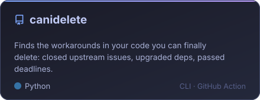
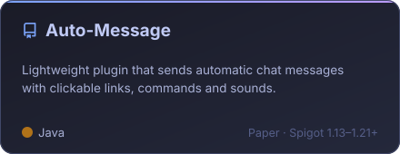
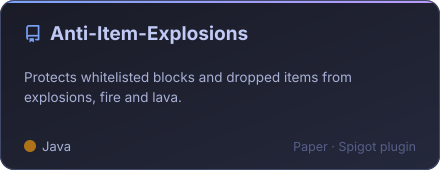
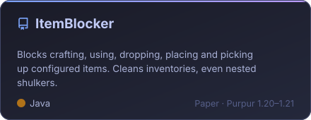

  

  
  
  

## 👨🏻‍💻 About me

- 🤖 I build **Discord bots** with Python and discord.js
- ⛏️ I make **Paper / Spigot / Purpur plugins** for Minecraft servers
- 🛠️ Latest project: **[canidelete](https://github.com/Telle-dev/canidelete)**, a tool that finds workarounds in your code you can finally delete
- 🌱 Currently leveling up in **TypeScript**
- 💬 Ask me about **Java**, **Python** or plugin development

## 🚀 Featured projects

<table>
  <tr>
    <td></td>
    <td></td>
  </tr>
  <tr>
    <td></td>
    <td></td>
  </tr>
</table>

## 🧰 Tech stack

  

## 📊 Stats

  
  

<picture>
  <source media="(prefers-color-scheme: dark)" srcset="https://raw.githubusercontent.com/Telle-dev/Telle-dev/output/snake-dark.svg">
  
</picture>

## 💜 Support

If my plugins or tools helped you, you can support me with Litecoin:

**LTC:** `LYAhqRNLjzSCfAzFKGLRnRA7qFnfidbT1U`

Stats and snake update automatically every day.

